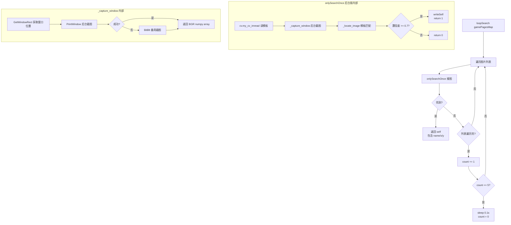

# multiphotos_bg.py 后台版设计方案

## 1. 目标

仿照 [`dao/multiphotos.py`](../dao/multiphotos.py) 的接口，创建 [`dao/multiphotos_bg.py`](../dao/multiphotos_bg.py)，实现**后台搜图 + 后台点击**，不占用用户鼠标键盘。

## 2. 当前问题分析

| 组件 | 当前实现 | 问题 |
|------|----------|------|
| 截图搜图 | `pyautogui.locateOnScreen()` 截取全屏 | 占用屏幕，干扰用户操作 |
| 鼠标点击 | `pyautogui.moveTo()` + `pyautogui.click()` | 物理移动鼠标，用户无法同时做其他事 |
| 键盘按键 | `pyautogui.press()` / `pydirectinput` | 占用键盘 |

## 3. 技术方案

### 3.1 后台截图 → 替换 `pyautogui.locateOnScreen`

```
win32gui.FindWindow → 获取窗口句柄
      ↓
win32gui.PrintWindow / BitBlt → 后台截取窗口画面（窗口可被遮挡，不可最小化）
      ↓
cv2.matchTemplate(截图, 模板, TM_CCOEFF_NORMED) → 模板匹配
      ↓
返回相对于窗口客户区的 (x, y) 坐标
```

**关键技术细节：**
- 使用 `PrintWindow` + `PW_RENDERFULLCONTENT` (Win8+) 实现真正的后台截图
- 失败时自动回退到 `BitBlt`（需要窗口不被遮挡）
- 通过 `GetClientRect` + `ClientToScreen` 计算客户区偏移，确保坐标可直接用于 PostMessage

### 3.2 后台点击 → 替换 `pyautogui.moveTo/click`

```
PostMessage(hwnd, WM_LBUTTONDOWN, MK_LBUTTON, MAKELONG(x, y))
    ↓ sleep(0.05)
PostMessage(hwnd, WM_LBUTTONUP, 0, MAKELONG(x, y))
```

完全不移动真实鼠标指针。

### 3.3 后台按键（附加：配合 `daoImpl` 扩展）

```
PostMessage(hwnd, WM_KEYDOWN, vk_code, 0)
    ↓ sleep(0.05)
PostMessage(hwnd, WM_KEYUP, vk_code, 0)
```

用于替代 `pyautogui.press("F")` 等操作（如 gundamOC.py 中的 `dao.pressKey("F")`）。

## 4. 接口设计（100% 兼容 multiphotos.py）

### 4.1 Photo 类的变化

```python
class Photo:
    def __init__(self, window_title=None):
        # 新增：获取窗口句柄
        # 优先使用传入参数，否则从 changeVar 读取 window_title
        # 与原版相同：self.name, self.x, self.y
        # 新增：self.hwnd, self.window_rect

    # 以下方法签名与原版 multiphotos.py 完全一致：

    def writeSelf(self, name, x, y):
        """不变，但 x, y 含义变为客户区相对坐标"""

    def onlySearchOnce(self, name, mode, times):
        """内部改为后台截图+matchTemplate，返回1/0"""

    def loopSearch(self, gamePagesMap):
        """逻辑完全不变，但调用后台版 onlySearchOnce"""

    def firstClickSearch(self, gamePagesMap):
        """逻辑不变，点击改为 PostMessage 后台点击窗口中心"""

    def searchPhoto(self, name):
        """内部改为后台截图+matchTemplate"""

    def __str__(self):
        """不变"""
```

### 4.2 新增辅助方法

| 方法 | 功能 | 备注 |
|------|------|------|
| `_capture_window()` | 后台截取目标窗口画面 | 返回 BGR numpy array |
| `_locate_image(template, screenshot)` | 在截图中匹配模板 | 返回 (x, y, w, h) 客户区坐标 |
| `_bg_click(x, y)` | 后台点击指定客户区坐标 | PostMessage |
| `_bg_double_click(x, y)` | 后台双击 | 间隔 0.1s |
| `_bg_press_key(vk_code)` | 后台按键 | PostMessage WM_KEYDOWN/UP |
| `_refresh_hwnd()` | 刷新窗口句柄 | 窗口重建后重新获取 |

## 5. 所需依赖

```python
import win32gui      # pywin32
import win32ui       # pywin32
import win32con      # pywin32
import win32api      # pywin32
import numpy as np   # numpy
import cv2           # opencv-python
import time
from . import dao    # my_cv_imread()
from . import changeVar as cv  # path, get_value/set_value
```

## 6. 使用方式对比

### 原版 multiphotos.py 用法
```python
from dao import multiphotos, dao

photoMap = multiphotos.Photo()
photoMaps = ["挑战成功", "挑战成功2"]
while 1:
    photoMap.loopSearch(photoMaps)
    x = photoMap.x  # 屏幕绝对坐标
    y = photoMap.y
    dao.moveTo(x, y)  # pyautogui 物理移动鼠标点击
```

### 后台版 multiphotos_bg.py 用法
```python
from dao import multiphotos_bg, dao

photoMap = multiphotos_bg.Photo(window_title="SD高达")  # 传入窗口标题
photoMaps = ["挑战成功", "挑战成功2"]
while 1:
    photoMap.loopSearch(photoMaps)
    x = photoMap.x  # 窗口客户区相对坐标
    y = photoMap.y
    photoMap._bg_click(x, y)  # 后台 PostMessage 点击
    # 或配合 dao 扩展方法：
    # dao.bg_moveTo(photoMap, x, y)
```

## 7. 与现有代码的集成

### 7.1 changeVar.py 新增配置项
```python
window_title = "SD高达"  # 默认窗口标题
```

在 `_init()` 的 `gloVar` 中添加：
```python
gloVar = {"device": device, "path": FgoPath, "window_title": "SD高达"}
```

### 7.2 daoImpl.py 建议新增（可选）
```python
def bg_moveTo(photo, x, y):
    """后台点击：接受 Photo 对象和客户区坐标"""
    photo._bg_click(x, y)

def bg_moveToNew(photo, x, y):
    """后台 mousedown/mouseup 点击"""
    ...

def bg_pressKey(photo, key):
    """后台按键"""
    ...
```

## 8. 潜在风险与应对

| 风险 | 影响 | 应对措施 |
|------|------|----------|
| PrintWindow 对某些游戏失效 | 截图全黑/全白 | 自动回退 BitBlt，BitBlt 也失败时记录日志 |
| 窗口最小化时截图失败 | 无法搜图 | 检测窗口状态，若最小化则先恢复窗口 |
| 窗口分辨率变化 | 坐标偏移 | 每次截图前刷新 GetClientRect |
| cv2.matchTemplate 置信度差异 | 匹配不准 | 保留 0.7 默认值，支持通过参数调整 |
| PostMessage 对某些游戏无效 | 点击无响应 | 提供降级选项（回退到 pyautogui） |

## 9. 文件结构

```
dao/
├── multiphotos.py          # 原版（pyautogui，占用鼠标键盘）
├── multiphotos_bg.py       # 新版（后台，PostMessage + PrintWindow）
├── airMultiPhotos.py        # Android 版（airtest）
├── changeVar.py             # 配置（新增 window_title）
├── dao.py                   # 接口层（不变）
└── daoImpl.py               # 实现层（可选新增 bg_ 前缀方法）
```

## 10. loSearch 逻辑流程图


